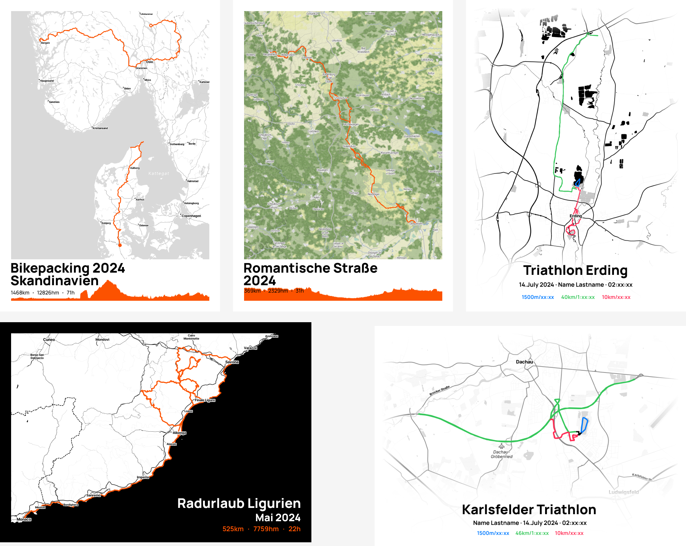

# prettyGPXMaps

With the R Markdown notebooks in this repository maps with a `.gpx` track overlay, and elevation profile plots can be generated. The results were used to create posters like these examples:

## Getting Started

The project can be opened in [RStudio](https://posit.co/downloads/), everything needed to generate maps is contained in the [GPXMaps.Rmd](./GPXMaps.Rmd) and [GPXMapsMulticolor.Rmd](./GPXMapsMulticolor.Rmd) notebooks.

The maps are loaded from [Stadia Maps](https://stadiamaps.com/). The following raster map styles can be used: `stamen_toner_lite, stamen_toner, stamen_terrain, alidade_smooth, alidade_smooth_dark` (See how they look [here](https://docs.stadiamaps.com/themes/).)

To access the maps a (free) personal API key has to be used. You can obtain one by following the instructions [here](https://docs.stadiamaps.com/authentication/#api-keys). After you created your API key either create a `.Renviron` file in the project root directory with the line `STADIAMAPS_API_KEY = your_api_key` (and reload the project), or directly replace the `Sys.getenv("STADIAMAPS_API_KEY")` call in the first code block of the notebooks with your API key.

## Poster Templates

The [Figma](https://www.figma.com) file used to create the example posters shown at the top can be found in the [figures](./figures/) folder (`prettyGPXposter_examples.fig`)
